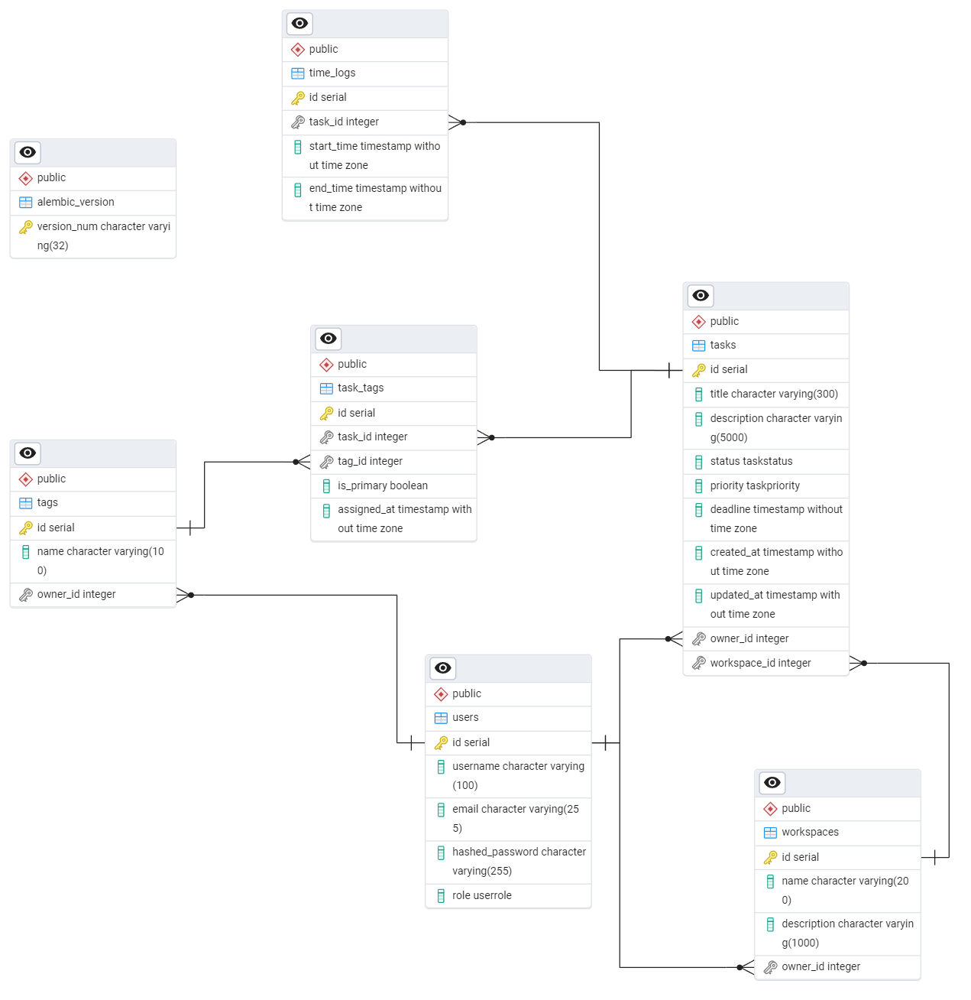

# Отчёт по лабораторной работе №1  
## Реализация серверного приложения FastAPI

---

## Цель работы

Научится реализовывать полноценное серверное приложение с помощью фреймворка FastAPI с применением дополнительных средств и библиотек.

---

## Структура проекта

```
app/
├── core/
│   ├── database.py      # Подключение к БД, сессии
│   ├── auth.py          # JWT-аутентификация, зависимости
│   └── config.py        # Настройки приложения
├── models/              # SQLModel-модели (таблицы БД)
│   ├── task.py
│   ├── task_tag.py
│   ├── tag.py
│   ├── workspace.py
│   ├── time_log.py
│   └── user.py
├── schemas/
│   ├── task.py
│   ├── task_tag.py
│   ├── tag.py
│   ├── workspace.py
│   ├── time_log.py
│   ├── user.py
│   └── analytics.py
├── routers/             # Эндпоинты API
│   ├── tasks.py
│   ├── tags.py
│   ├── workspaces.py
│   └── analytics.py
|   └── auth.py
├── main.py              # Точка входа, регистрация роутеров
└── alembic/             # Миграции БД
```

---

## Подключение к базе данных

### `app/core/database.py`
```python
from sqlmodel import SQLModel, create_engine, Session
from app.core.config import get_settings

settings = get_settings()

engine = create_engine(settings.DATABASE_URL, echo=False)


def init_db():
    SQLModel.metadata.create_all(engine)


def get_session():
    with Session(engine) as session:
        yield session
```

### `app/core/config.py`
```python
from pydantic_settings import BaseSettings
from functools import lru_cache


class Settings(BaseSettings):
    DATABASE_URL: str
    SECRET_KEY: str
    ALGORITHM: str
    ACCESS_TOKEN_EXPIRE_MINUTES: int

    class Config:
        env_file = ".env"


@lru_cache()
def get_settings() -> Settings:
    return Settings()
```

---

## Схема базы данных



---

## Реализованные эндпоинты

### Задачи (`/api/tasks`)

| Метод | Путь | Описание | `response_model` |
|-------|------|----------|-----------------|
| `POST` | `/` | Создание задачи с тегами | `TaskOut` |
| `GET` | `/` | Список задач с пагинацией и фильтрацией | `TaskListOut` |
| `GET` | `/{id}` | Получение задачи с вложенными данными | `TaskOut` |
| `PATCH` | `/{id}` | Частичное обновление задачи | `TaskOut` |
| `DELETE` | `/{id}` | Удаление задачи | `204 No Content` |
| `POST` | `/{id}/timer/start` | Запуск таймера учёта времени | `TimeLogRead` |
| `POST` | `/{id}/timer/pause` | Пауза таймера | `TimeLogRead` |
| `POST` | `/{id}/timer/stop` | Остановка таймера | `TimeLogRead` |
| `GET` | `/upcoming-deadlines/` | Задачи с ближайшими дедлайнами | `TaskListOut` |

### Теги (`/api/tags`)

| Метод | Путь | Описание | `response_model` |
|-------|------|----------|-----------------|
| `POST` | `/` | Создание тега | `TagRead` |
| `GET` | `/` | Список тегов пользователя | `TagListOut` |
| `GET` | `/{id}` | Получение тега | `TagRead` |
| `PUT` | `/{id}` | Полное обновление тега | `TagRead` |
| `DELETE` | `/{id}` | Удаление тега | `204 No Content` |

### Рабочие пространства (`/api/workspaces`)

| Метод | Путь | Описание | `response_model` |
|-------|------|----------|-----------------|
| `POST` | `/` | Создание пространства | `WorkspaceRead` |
| `GET` | `/` | Список пространств | `WorkspaceListOut` |
| `GET` | `/{id}` | Пространство с задачами | `WorkspaceWithTasksRead` |
| `PATCH` | `/{id}` | Обновление пространства | `WorkspaceRead` |
| `DELETE` | `/{id}` | Удаление пространства | `204 No Content` |

### Аналитика (`/api/analytics`)

| Метод | Путь | Описание | `response_model` |
|-------|------|----------|-----------------|
| `GET` | `/total-time` | Общее время работы пользователя | `TotalTimeResponse` |
| `GET` | `/by-tag` | Время по тегам | `TagTimeResponse` |
| `GET` | `/by-workspace` | Время по рабочим пространствам | `WorkspaceTimeResponse` |
| `GET` | `/by-period` | Время за период | `PeriodTimeResponse` |
| `GET` | `/task/{id}` | Детализация времени по задаче | `TaskTimeResponse` |

---

## Аутентификация

- **JWT-токены** с алгоритмом HS256
- **Зависимость** `get_current_user` для защиты эндпоинтов
- **Изоляция данных**: каждый пользователь видит только свои задачи, теги и пространства
- **Валидация прав доступа** при операциях с чужими ресурсами (возврат `403 Forbidden`)


---

## Миграции (Alembic)

### Генерация миграции
```bash
alembic revision --autogenerate -m "add_tasks_table"
```

### Применение миграций
```bash
alembic upgrade head      # Применить все миграции
alembic downgrade -1      # Откатить последнюю
alembic current           # Показать текущую версию
```

---

## Запуск проекта

```bash
# 1. Установка зависимостей
pip install -r requirements.txt

# 2. Настройка переменных окружения
cp .env.example .env
# Отредактировать DATABASE_URL, SECRET_KEY

# 3. Применение миграций
alembic upgrade head

# 4. Запуск сервера
fastapi dev app/main.py
# или для продакшена:
uvicorn app.main:app --host 0.0.0.0 --port 8000
```
