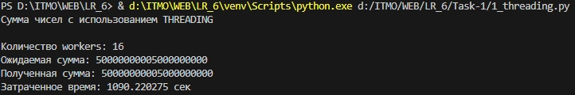
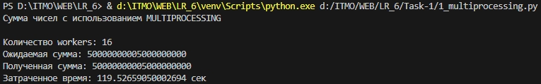
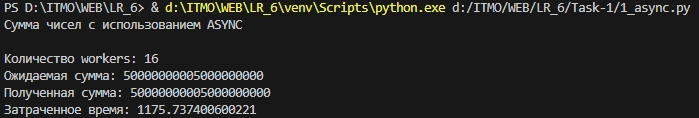
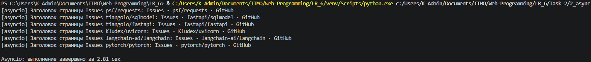
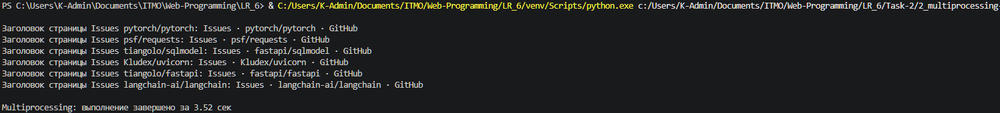
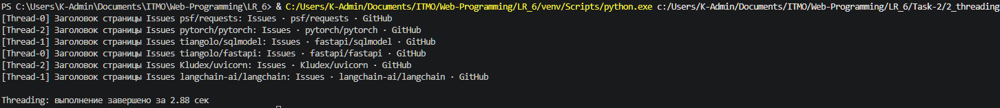

# Отчёт по лабораторной работе №2. Потоки. Процессы. Асинхронность.

## Задача 1: Различия между threading, multiprocessing и async в Python

### Постановка задачи
Напишите три различных программы на Python, использующие каждый из подходов: threading, multiprocessing и async. Каждая программа должна решать считать сумму всех чисел от 1 до 10000000000. Разделите вычисления на несколько параллельных задач для ускорения выполнения.  

### Математическая проверка
Данная последовательность образует арифметическую прогрессию, поэтому результат подсчёта можно проверить математически. 
`S = N × (N + 1) / 2 = 10¹⁰ × (10¹⁰ + 1) / 2 = 50 000 000 005 000 000 000`

### Общие параметры
```python
N = 10_000_000_000  # Верхняя граница суммы
WORKERS_NUM = os.cpu_count()  # 16 потоков/процессов
CHUNK_SIZE = N // WORKERS_NUM  # Размер блока для каждого worker
EXPECTED_SUM = N * (N + 1) // 2 # Математически подсчитанная сумма для проверки
```

### 2.1. Реализация на threading

```python
def calculate_sum(start, end, results, index):
    part_sum = 0
    for i in range(start, end + 1):
        part_sum += i
    results[index] = part_sum

def main():
    ranges = []
    for i in range(WORKERS_NUM):
        start = i * CHUNK_SIZE + 1
        end = (i + 1) * CHUNK_SIZE if i < WORKERS_NUM - 1 else N
        ranges.append((start, end))

    threads = []
    results = [0] * WORKERS_NUM

    start_t = time.perf_counter()

    for i, (start, end) in enumerate(ranges):
        t = threading.Thread(
            target=calculate_sum,
            args=(start, end, results, i)
        )
        threads.append(t)
        t.start()

    for t in threads:
        t.join()

    total_sum = sum(results)
    elapsed_t = time.perf_counter() - start_t

    print("Сумма чисел с использованием THREADING\n")
    print(f"Количество workers: {WORKERS_NUM}")
    print(f"Ожидаемая сумма: {EXPECTED_SUM}")
    print(f"Полученная сумма: {total_sum}")
    print(f"Затраченное время: {elapsed_t:.6f} сек")

if __name__ == "__main__":
    main()
```

Каждый поток выполняет чистый Python-цикл, GIL разрешает работать только одному потоку одновременно, поэтому параллельного ускорения нет. Общее время почти равно последовательному выполнению.



### 2.2. Реализация на multiprocessing

```python
def calculate_sum(start, end):
    part_sum = 0
    for i in range(start, end+1):
        part_sum += i
    return part_sum

def main():
    ranges = []
    for i in range(WORKERS_NUM):
        start = i * CHUNK_SIZE + 1
        end = (i + 1) * CHUNK_SIZE if i < WORKERS_NUM - 1 else N
        ranges.append((start, end))

    start_t = time.perf_counter()

    with multiprocessing.Pool(processes=WORKERS_NUM) as pool:
        sums = pool.starmap(calculate_sum, ranges)
    
    total_sum = sum(sums)

    elapsed_t = time.perf_counter() - start_t

    print("Сумма чисел с использованием MULTIPROCESSING\n")
    print(f"Количество workers: {WORKERS_NUM}")
    print(f"Ожидаемая сумма: {EXPECTED_SUM}")
    print(f"Полученная сумма: {total_sum}")
    print(f"Затраченное время: {elapsed_t} сек")

if __name__ == "__main__":
    main()
```

Каждое подвыражение вычисляется в отдельном процессе, имеющем собственный GIL, поэтому все ядра CPU загружены работой. Накладные расходы на создание процессов окупаются многократным ускорением вычислений.



### 2.3. Реализация на asyncio

```python
def calculate_sum(start, end):
    part_sum = 0
    for i in range(start, end+1):
        part_sum += i
    return part_sum

async def main():
    tasks = [asyncio.to_thread(calculate_sum,
                               i * CHUNK_SIZE + 1,
                               (i + 1) * CHUNK_SIZE if i < WORKERS_NUM - 1 else N
                               )
                               for i in range(WORKERS_NUM)]

    start_t = time.perf_counter()
    sums = await asyncio.gather(*tasks)
    total_sum = sum(sums)
    elapsed_t = time.perf_counter() - start_t

    print("Сумма чисел с использованием ASYNC\n")
    print(f"Количество workers: {WORKERS_NUM}")
    print(f"Ожидаемая сумма: {EXPECTED_SUM}")
    print(f"Полученная сумма: {total_sum}")
    print(f"Затраченное время: {elapsed_t}")

if __name__ == "__main__":
    asyncio.run(main())
```

В async-варианте я обернул синхронный счёт в asyncio.to_thread и собрал результаты через asyncio.gather. По сути это снова потоки, поэтому для CPU-bound нагрузки время близко к threading-версии и заметно медленнее multiprocessing.



### 2.4. Результаты и сравнение

| Подход | Время выполнения (сек) |
|--------|----------------------|
| **Threading** | 1090,22 |
| **Asyncio** | 1175,74 |
| **Multiprocessing** | 119,53 |


### Анализ результатов

- Multiprocessing показал почти 10-кратное ускорение относительно других вариантов благодаря реальной возможности параллельно выполнять Python-код на разных ядрах процессора.

- Threading и Async выполнились практически за одно и то же время. Оба подхода страдают от GIL, а async дополнительно тратит время на переключение контекста event loop.

- Для CPU-bound-задач multiprocessing является единственным эффективным решением.

---

## Задача 2: Параллельный парсинг веб-страниц с сохранением в БД

### Постановка задачи
Напишите программу на Python для параллельного парсинга нескольких веб-страниц с сохранением данных в базу данных с использованием подходов threading, multiprocessing и async. Каждая программа должна парсить информацию с нескольких веб-сайтов, сохранять их в базу данных.

**Тестируемые URL:**
```python
urls = [
    "https://github.com/psf/requests/issues",
    "https://github.com/tiangolo/fastapi/issues", 
    "https://github.com/tiangolo/sqlmodel/issues",
    "https://github.com/langchain-ai/langchain/issues",
    "https://github.com/pytorch/pytorch/issues",
    "https://github.com/Kludex/uvicorn/issues",
]
```

Для каждого URL необходимо:

1. Загрузить HTML.
2. Распарсить заголовок страницы и список Issues.
3. Сохранить workspace и задачи в соответствующие таблицы PostgreSQL (модели Workspace, Task, Tag, TaskTag).

Выполнение разбивается на равные части по числу параллельных исполнителей.  

Используемая БД: PostgreSQL, взаимодействие через SQLAlchemy/SQLModel, синхронный драйвер psycopg2 (для threading и multiprocessing) и асинхронный asyncpg (для async). Для HTTP-запросов в потоках/процессах — requests, в async — aiohttp.

### 3.2. Реализация подходов

#### Asyncio
```python
import os
import asyncio
import time
from urllib.parse import urlparse, urljoin

import aiohttp
from bs4 import BeautifulSoup
from dotenv import load_dotenv
from sqlalchemy.ext.asyncio import create_async_engine, async_sessionmaker, AsyncSession
from sqlmodel import select

from models import Workspace, Tag, Task, TaskTag, TaskStatus, TaskPriority

load_dotenv()

DATABASE_URL_ASYNC = os.getenv("DATABASE_URL")
DEFAULT_USER_ID = 1


def extract_owner_repo_from_url(url):
    parsed = urlparse(url)
    path_parts = [p for p in parsed.path.split("/") if p]
    return path_parts[0], path_parts[1]


def parse_issues_from_page(html):
    soup = BeautifulSoup(html, "html.parser")
    tasks = []
    seen_urls = set()

    title_links = soup.find_all("a", attrs={"data-testid": "issue-pr-title-link"})
    for link in title_links:
        issue_url = link.get("href", "")
        if not issue_url:
            continue
        if issue_url.startswith("/"):
            issue_url = urljoin("https://github.com", issue_url)
        if issue_url in seen_urls:
            continue
        seen_urls.add(issue_url)

        title = link.get_text(strip=True)
        if not title or len(title) < 3:
            continue

        labels = []
        issue_li = link.find_parent("li")
        if issue_li:
            for badge in issue_li.find_all("div", class_=lambda c: c and "TrailingBadge" in c):
                lbl_span = badge.find("span", class_=lambda c: c and "prc-Text-Text-" in c)
                if lbl_span:
                    label_text = lbl_span.get_text(strip=True)
                    if label_text:
                        labels.append(label_text)

        tasks.append({"title": title, "url": issue_url, "labels": labels})
    return tasks


async def get_or_create_workspace(db, full_name, description, owner_id):
    result = await db.execute(select(Workspace).where(Workspace.name == full_name))
    workspace = result.scalar_one_or_none()
    if not workspace:
        workspace = Workspace(name=full_name, description=description, owner_id=owner_id)
        db.add(workspace)
        await db.flush()
    return workspace


async def task_exists(db: AsyncSession, title: str, workspace_id: int) -> bool:
    result = await db.execute(
        select(Task).where(Task.title == title, Task.workspace_id == workspace_id)
    )
    return result.first() is not None


async def parse_and_save(engine, session_factory, http_session, issues_url, owner_id):
    owner, repo = extract_owner_repo_from_url(issues_url)
    full_name = f"{owner}/{repo}"

    headers = {"User-Agent": "Lab-Parser/1.0"}
    async with http_session.get(issues_url, headers=headers) as resp:
        resp.raise_for_status()
        html = await resp.text()

    soup = BeautifulSoup(html, "html.parser")
    title_tag = soup.find("title")
    page_title = title_tag.get_text(strip=True) if title_tag else None
    description = f"{page_title} | {issues_url}" if page_title else issues_url

    print(f"Заголовок страницы Issues {full_name}: {page_title}")

    issues = parse_issues_from_page(html)

    async with session_factory() as db:
        workspace = await get_or_create_workspace(db, full_name, description, owner_id)

        for issue in issues:
            if await task_exists(db, issue["title"], workspace.id):
                continue

            task = Task(
                title=issue["title"][:300],
                description=issue["url"],
                status=TaskStatus.todo,
                priority=TaskPriority.medium,
                owner_id=owner_id,
                workspace_id=workspace.id,
            )
            db.add(task)
            await db.flush()

            seen_labels = set()
            for label_name in issue["labels"]:
                label_name = label_name.strip()
                if not label_name or label_name in seen_labels:
                    continue
                seen_labels.add(label_name)

                result = await db.execute(
                    select(Tag).where(Tag.name == label_name, Tag.owner_id == owner_id)
                )
                tag = result.scalars().first()
                if not tag:
                    tag = Tag(name=label_name, owner_id=owner_id)
                    db.add(tag)
                    await db.flush()

                task_tag = TaskTag(task_id=task.id, tag_id=tag.id, is_primary=False)
                db.add(task_tag)

        await db.commit()


async def limited_parse(semaphore, *args, **kwargs):
    async with semaphore:
        await parse_and_save(*args, **kwargs)


async def main():
    urls = [
        "https://github.com/psf/requests/issues",
        "https://github.com/tiangolo/fastapi/issues",
        "https://github.com/tiangolo/sqlmodel/issues",
        "https://github.com/langchain-ai/langchain/issues",
        "https://github.com/pytorch/pytorch/issues",
        "https://github.com/Kludex/uvicorn/issues",
    ]

    engine = create_async_engine(DATABASE_URL_ASYNC, echo=False, pool_size=5)
    session_factory = async_sessionmaker(engine, expire_on_commit=False)

    semaphore = asyncio.Semaphore(3)

    async with aiohttp.ClientSession() as http_session:
        tasks = [
            limited_parse(semaphore, engine, session_factory, http_session, url, DEFAULT_USER_ID)
            for url in urls
        ]
        start = time.time()
        await asyncio.gather(*tasks)

    await engine.dispose()
    elapsed = time.time() - start
    print(f"\nAsyncio: выполнение завершено за {elapsed:.2f} сек")


if __name__ == "__main__":
    asyncio.run(main())
```

- Единый event loop, общий aiohttp.ClientSession и асинхронный движок БД (create_async_engine).

- Для каждого URL создаётся корутина, заключённая в семафор, ограничивающий одновременные запросы для предотвращения блокировок со стороны GitHub.

- Все HTTP-запросы и операции БД неблокирующие.



#### Multiprocessing
```python
import os
import time
import multiprocessing
from urllib.parse import urlparse, urljoin

import requests
from bs4 import BeautifulSoup
from dotenv import load_dotenv
from sqlmodel import Session, create_engine, select

from models import Workspace, Tag, Task, TaskTag, TaskStatus, TaskPriority

load_dotenv()

DATABASE_URL = os.getenv("DATABASE_URL", "").replace("+asyncpg", "+psycopg2")
DEFAULT_USER_ID = 1


def extract_owner_repo_from_url(url):
    parsed = urlparse(url)
    path_parts = [p for p in parsed.path.split("/") if p]
    return path_parts[0], path_parts[1]


def parse_issues_from_page(html):
    soup = BeautifulSoup(html, "html.parser")
    tasks = []
    seen_urls = set()

    title_links = soup.find_all("a", attrs={"data-testid": "issue-pr-title-link"})

    for link in title_links:
        issue_url = link.get("href", "")
        if not issue_url:
            continue
        if issue_url.startswith("/"):
            issue_url = urljoin("https://github.com", issue_url)
        if issue_url in seen_urls:
            continue
        seen_urls.add(issue_url)

        title = link.get_text(strip=True)
        if not title or len(title) < 3:
            continue

        labels = []
        issue_li = link.find_parent("li")
        if issue_li:
            for badge in issue_li.find_all("div", class_=lambda c: c and "TrailingBadge" in c):
                lbl_span = badge.find("span", class_=lambda c: c and "prc-Text-Text-" in c)
                if lbl_span:
                    label_text = lbl_span.get_text(strip=True)
                    if label_text:
                        labels.append(label_text)

        tasks.append({
            "title": title,
            "url": issue_url,
            "labels": labels,
        })

    return tasks


def get_or_create_workspace(db, full_name, description, owner_id):
    workspace = db.execute(
        select(Workspace).where(Workspace.name == full_name)
    ).scalar_one_or_none()
    if not workspace:
        workspace = Workspace(name=full_name, description=description, owner_id=owner_id)
        db.add(workspace)
        db.flush()
    return workspace


def task_exists(db, title, workspace_id):
    return db.execute(
        select(Task).where(
            Task.title == title,
            Task.workspace_id == workspace_id
        )
    ).first() is not None


def parse_and_save(engine, issues_url, owner_id):
    owner, repo = extract_owner_repo_from_url(issues_url)
    full_name = f"{owner}/{repo}"

    headers = {"User-Agent": "Lab-Parser/1.0"}
    resp = requests.get(issues_url, headers=headers)
    resp.raise_for_status()

    soup = BeautifulSoup(resp.text, "html.parser")
    title_tag = soup.find("title")
    page_title = title_tag.get_text(strip=True) if title_tag else None
    description = f"{page_title} | {issues_url}" if page_title else issues_url

    print(f"Заголовок страницы Issues {full_name}: {page_title}")

    issues = parse_issues_from_page(resp.text)

    with Session(engine) as db:
        workspace = get_or_create_workspace(db, full_name, description, owner_id)

        for issue in issues:
            if task_exists(db, issue["title"], workspace.id):
                continue

            task = Task(
                title=issue["title"][:300],
                description=issue["url"],
                status=TaskStatus.todo,
                priority=TaskPriority.medium,
                owner_id=owner_id,
                workspace_id=workspace.id,
            )
            db.add(task)
            db.flush()

            seen_labels = set()
            for label_name in issue["labels"]:
                label_name = label_name.strip()
                if not label_name or label_name in seen_labels:
                    continue
                seen_labels.add(label_name)

                tag = db.execute(
                    select(Tag).where(Tag.name == label_name, Tag.owner_id == owner_id)
                ).scalars().first()
                if not tag:
                    tag = Tag(name=label_name, owner_id=owner_id)
                    db.add(tag)
                    db.flush()

                task_tag = TaskTag(task_id=task.id, tag_id=tag.id, is_primary=False)
                db.add(task_tag)

        db.commit()


def process_target(urls, owner_id):
    engine = create_engine(DATABASE_URL, echo=False)
    try:
        for url in urls:
            parse_and_save(engine, url, owner_id)
    finally:
        engine.dispose()


def main():
    urls = [
        "https://github.com/psf/requests/issues",
        "https://github.com/tiangolo/fastapi/issues",
        "https://github.com/tiangolo/sqlmodel/issues",
        "https://github.com/langchain-ai/langchain/issues",
        "https://github.com/pytorch/pytorch/issues",
        "https://github.com/Kludex/uvicorn/issues",
    ]

    NUM_PROCS = 3
    chunk_size = len(urls) // NUM_PROCS + (1 if len(urls) % NUM_PROCS else 0)
    chunks = [urls[i:i + chunk_size] for i in range(0, len(urls), chunk_size)]

    start = time.time()
    processes = []
    for chunk in chunks:
        p = multiprocessing.Process(target=process_target, args=(chunk, DEFAULT_USER_ID))
        processes.append(p)
        p.start()

    for p in processes:
        p.join()
    elapsed = time.time() - start
    print(f"\nMultiprocessing: выполнение завершено за {elapsed:.2f} сек")


if __name__ == "__main__":
    main()
```

- Создаётся NUM_PROCS процессов.

- Каждому процессу передаётся подмножество URL.

- Внутри процесса создаётся свой engine к БД (подключения не разделяются между процессами).

- Обработка каждого URL выполняется последовательно (один процесс – один список запросов), используется синхронный requests.



#### Threading
```python
import os
import time
import threading
from urllib.parse import urlparse, urljoin

import requests
from bs4 import BeautifulSoup
from dotenv import load_dotenv
from sqlmodel import Session, create_engine, select

from models import Workspace, Tag, Task, TaskTag, TaskStatus, TaskPriority

load_dotenv()

DATABASE_URL = os.getenv("DATABASE_URL", "").replace("+asyncpg", "+psycopg2")
DEFAULT_USER_ID = 1


def extract_owner_repo_from_url(url):
    parsed = urlparse(url)
    path_parts = [p for p in parsed.path.split("/") if p]
    return path_parts[0], path_parts[1]


def parse_issues_from_page(html):
    soup = BeautifulSoup(html, "html.parser")
    tasks = []
    seen_urls = set()

    title_links = soup.find_all("a", attrs={"data-testid": "issue-pr-title-link"})
    for link in title_links:
        issue_url = link.get("href", "")
        if not issue_url:
            continue
        if issue_url.startswith("/"):
            issue_url = urljoin("https://github.com", issue_url)
        if issue_url in seen_urls:
            continue
        seen_urls.add(issue_url)

        title = link.get_text(strip=True)
        if not title or len(title) < 3:
            continue

        labels = []
        issue_li = link.find_parent("li")
        if issue_li:
            for badge in issue_li.find_all("div", class_=lambda c: c and "TrailingBadge" in c):
                lbl_span = badge.find("span", class_=lambda c: c and "prc-Text-Text-" in c)
                if lbl_span:
                    label_text = lbl_span.get_text(strip=True)
                    if label_text:
                        labels.append(label_text)

        tasks.append({"title": title, "url": issue_url, "labels": labels})
    return tasks


def get_or_create_workspace(db, full_name, description, owner_id):
    workspace = db.execute(
        select(Workspace).where(Workspace.name == full_name)
    ).scalar_one_or_none()
    if not workspace:
        workspace = Workspace(name=full_name, description=description, owner_id=owner_id)
        db.add(workspace)
        db.flush()
    return workspace


def task_exists(db, title, workspace_id):
    return db.execute(
        select(Task).where(Task.title == title, Task.workspace_id == workspace_id)
    ).first() is not None


def parse_and_save(engine, issues_url, owner_id):
    owner, repo = extract_owner_repo_from_url(issues_url)
    full_name = f"{owner}/{repo}"

    headers = {"User-Agent": "Lab-Parser/1.0"}
    resp = requests.get(issues_url, headers=headers)
    resp.raise_for_status()

    soup = BeautifulSoup(resp.text, "html.parser")
    title_tag = soup.find("title")
    page_title = title_tag.get_text(strip=True) if title_tag else None
    description = f"{page_title} | {issues_url}" if page_title else issues_url

    print(f"[{threading.current_thread().name}] Заголовок страницы Issues {full_name}: {page_title}")

    issues = parse_issues_from_page(resp.text)

    with Session(engine) as db:
        workspace = get_or_create_workspace(db, full_name, description, owner_id)

        for issue in issues:
            if task_exists(db, issue["title"], workspace.id):
                continue

            task = Task(
                title=issue["title"][:300],
                description=issue["url"],
                status=TaskStatus.todo,
                priority=TaskPriority.medium,
                owner_id=owner_id,
                workspace_id=workspace.id,
            )
            db.add(task)
            db.flush()

            seen_labels = set()
            for label_name in issue["labels"]:
                label_name = label_name.strip()
                if not label_name or label_name in seen_labels:
                    continue
                seen_labels.add(label_name)

                tag = db.execute(
                    select(Tag).where(Tag.name == label_name, Tag.owner_id == owner_id)
                ).scalars().first()
                if not tag:
                    tag = Tag(name=label_name, owner_id=owner_id)
                    db.add(tag)
                    db.flush()

                task_tag = TaskTag(task_id=task.id, tag_id=tag.id, is_primary=False)
                db.add(task_tag)

        db.commit()


def thread_target(urls, owner_id, engine):
    for url in urls:
        parse_and_save(engine, url, owner_id)


def main():
    urls = [
        "https://github.com/psf/requests/issues",
        "https://github.com/tiangolo/fastapi/issues",
        "https://github.com/tiangolo/sqlmodel/issues",
        "https://github.com/langchain-ai/langchain/issues",
        "https://github.com/pytorch/pytorch/issues",
        "https://github.com/Kludex/uvicorn/issues",
    ]

    NUM_THREADS = 3
    chunk_size = len(urls) // NUM_THREADS + (1 if len(urls) % NUM_THREADS else 0)
    chunks = [urls[i:i + chunk_size] for i in range(0, len(urls), chunk_size)]

    engine = create_engine(DATABASE_URL, echo=False, pool_size=5, max_overflow=10)

    start = time.time()
    threads = []
    for chunk in chunks:
        t = threading.Thread(
            target=thread_target,
            args=(chunk, DEFAULT_USER_ID, engine),
            name=f"Thread-{len(threads)}"
        )
        threads.append(t)
        t.start()

    for t in threads:
        t.join()

    engine.dispose()
    elapsed = time.time() - start
    print(f"\nThreading: выполнение завершено за {elapsed:.2f} сек")


if __name__ == "__main__":
    main()
```

- Главный поток делит список URL на NUM_THREADS частей.

- Каждый поток получает свой подсписок URL и общий синхронный engine.

- Время ожидания сети в каждом потоке - основное место, где GIL отпускается, поэтому несколько потоков могут работать конкурентно.



### 3.3. Результаты выполнения

| Подход | Время выполнения (сек) |
|--------|----------------------|
| **Asyncio** | 2,81 |
| **Threading** | 2,88 |
| **Multiprocessing** | 3,52 |


### Анализ результатов

- Async (asyncio + aiohttp) оказался самым быстрым. Все запросы к сети и базе данных выполняются асинхронно в одном потоке.  

- Threading показал близкое к async время, так как requests.get() освобождает GIL на время сетевого ожидания. Небольшой проигрыш вызван затратами на создание потоков и переключение между ними, а также синхронным драйвером БД.  

- Multiprocessing в данной I/O-bound задаче проигрывает. Создание процессов и дублирование подключений к БД вносят значительную задержку. Внутри каждого процесса используется синхронный код, не способный распараллелить несколько запросов.  

**Вывод:** для сетевых и дисковых операций предпочтительнее asyncio или threading, multiprocessing здесь избыточен и медленнее.


## Выводы

1. Нет универсального решения: выбор подхода зависит от типа задачи (CPU-bound или I/O-bound).

2. Multiprocessing - оптимальный выбор для параллельных вычислений в Python благодаря обходу GIL.

3. Asyncio - наилучшее решение для высоконагруженных сетевых приложений.

4. Threading - компромиссный вариант для простых I/O-задач, но требует осторожности из-за GIL и потенциальных состояний гонки.